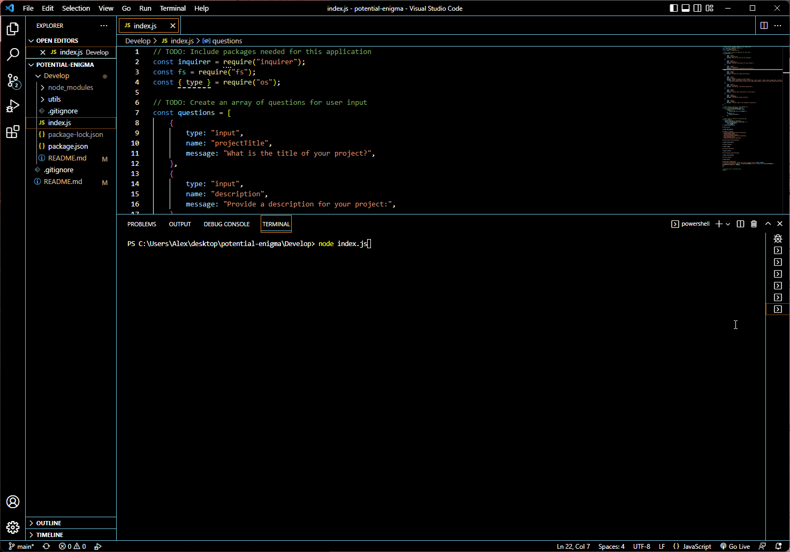

# README-Generator

## Description
        
Command Line application to save Developers time when creating README.md files for their projects. By dynamically generatoring READ.md file based on the user inputs to prompts. 

## Table of Contents
- [Installation](#installation-installation)
- [Usage](#usage-usage)
- [License](#license-license)
- [Contributing](#contributing-contributing)
- [Tests](#tests-tests)
- [Questions](#questions-questions)
        
## Installation {#installation}
        
To Install this application you must clone down this repository to your local machine. Then you open the directory in VS code and run the intergrated terminal from index.js .

## Usage {#usage}
        
To use this application. Step One: Open Directory in VS Code, Step Two: Open the intergrated terminal from Index.js, Step Three: Runcode "node index.js" to start application, Step Four: Answer Prompts, Step Five: After answering prompt README.md in Develop will be modified Step Six: Copy and Paste Modified README.md to your project README.md file 
        
## License {#license}
        
The Unlicense
        
## Contributing {#contributing}
        
Please don't contribute to this repository.
        
## Tests {#tests}
        
To test run Debug in package.json.
        
## Questions {#questions}
If you have any questions, please feel free to contact me at Alex.horning.54@gmail.com 
or check out my GitHub profile at [Makeitouthill](https://github.com/Makeitouthill).